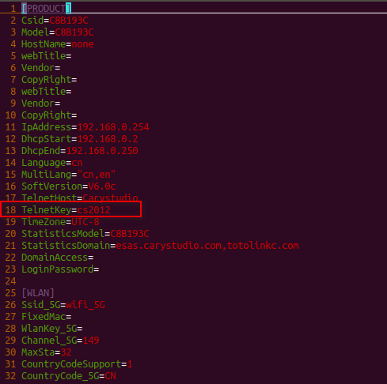

## CP450 hard code password for telnet

### Overview

* Vendor: TOTOLINK

* Product: CP450
* Version: TOTOLINK_C8B193C-1H_CP450_CP0017_8881A_SPI_8M64M_V4.1.0cu.747_B20191224_ALL.web

* Manufacturer's address：https://www.totolink.net/
* Firmware download address ：https://www.totolink.net/data/upload/20200414/2254ce90058da1a549566852c86031db.zip

### Vulnerability details

There is a hard code password for telnet in /web_cste/cgi-bin/product.ini

