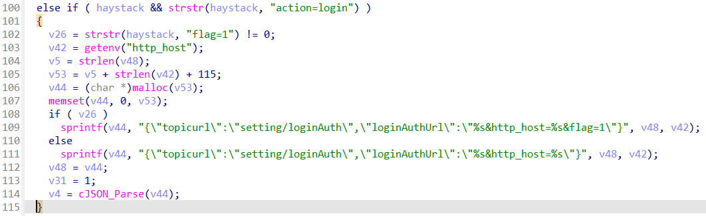
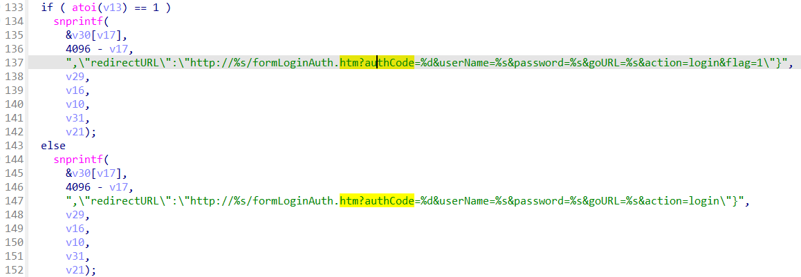
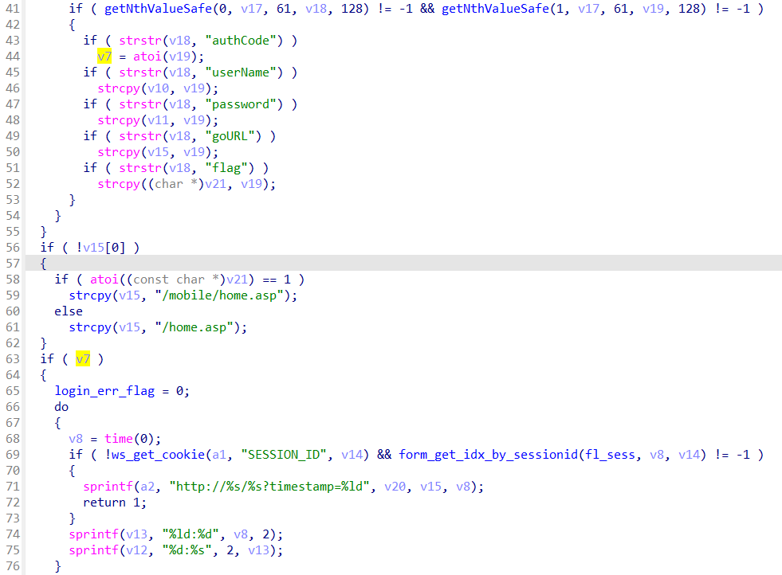

## CP450 Login Bypass

### Overview

* Vendor: TOTOLINK

* Product: CP450
* Version: TOTOLINK_C8B193C-1H_CP450_CP0017_8881A_SPI_8M64M_V4.1.0cu.747_B20191224_ALL.web

* Manufacturer's address：https://www.totolink.net/
* Firmware download address ：https://www.totolink.net/data/upload/20200414/2254ce90058da1a549566852c86031db.zip

### Vulnerability details

In `cstecgi.cgi`, the login request from the frontend is forwarded to the `loginAuth` function for checking.



`LoginAuth` function in `global.so`  verifies the username and password, and if it is successful, will jump to the URL in line 137 (we call it `victim URL` from now on) and passes authCode=1.



Then the webserver `lighttpd` will process the `formLoginAuth` request, if `v7 (authCode)` equals to 1, we will go to line 69 to get cookie and then go to the target url passed by the `goURL` parameter.



In summary, we can construct a `victim url`, let `authcode`=1 and set the `goURL` that we need, and then we can go anywhere without any authentication.

#### PoC

```
curl http://192.168.0.254/formLoginAuth.htm?authCode=1&action=login&goURL=home.asp
```
